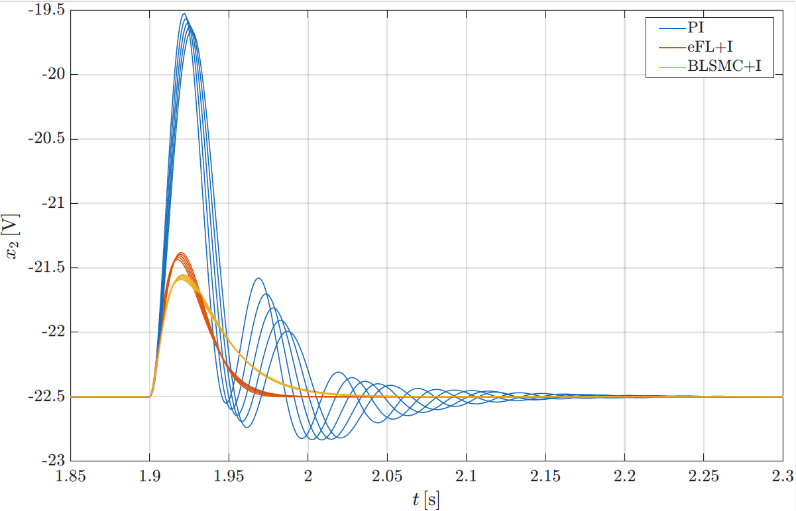
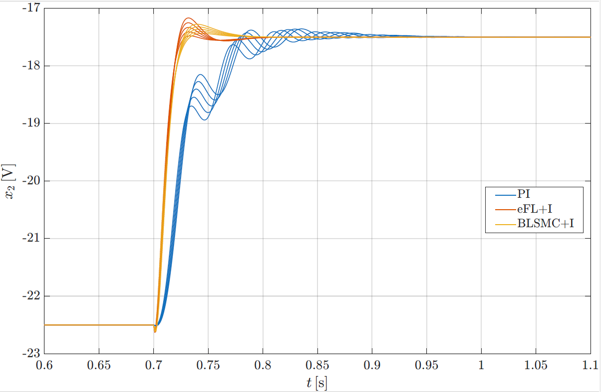

# Regulacija Buck-Boost konvertora

## Opis projekta

Ovaj projekat rađen je na kursu Nelinearni sistemi upravljanja 2 na Elektrotehničkom fakultetu u Beogradu.
Cilj projekta jeste regulacija DC-DC Buck-Boost konvertora.
Regulacija je sprovedena tri načina:
- Linearna regulacija:
  - PI kontroler,
  - Kontroler na bazi inverzije dinamike,
  - PID sa ZN podešavanjem
- Egzaktna Feedback Linearizacija sa integralnim dejstvom
- Klizno upravljanje (Sliding Mode Control) sa integralnim dejstvom i graničnim slojem

Sekvenca pobuda kojom će se testirati svaki regulator je:
1) Prelazak iz početnom u nominalno stanje,
2) Pozitivan step reference,
3) Negativan step reference,
4) Poremećaj u obliku promene ulaznog napona.

Svi detalji oko samih vrednosti veličina koje odlikuju sam konvertor, kao i
sekvenca pobuda, mogu se naći u poglavlju dva izveštaja u folderu
Projekat_3_komparativna_analiza

Veličine koje se prate u vremenu su:
- Promenljive stanja,
- Merena promenljiva,
- Pozicija sistema u prostoru stanja,
- Upravljanje.

Za svaki metod, prate se performanse regulisanog sistema u sledećim konfiguracijama:
- Slučaj bez postojanja šuma
- Slučaj sa postojanjem belog Gausovog šuma varijanse 3% nominalne vrednosti merene promenljive
- Slučaj sa raznim realnim vrednostima induktivnosti kalema, kao test na robusnost regulacija
  na promenu ove veličine
  
Na kraju je sprovedena komparativna analiza između najboljeg
linearnog regulatora i nelinearnih metoda regulacije. Na sledećim slikama prikazano je par detalja
vremenskog odziva za sve kontrolere, a za različite vrednosti induktivnosti kalema:

<figure style="text-align: center;">
  
  <figcaption>Uporedni prikaz rada kontrolera kod pojave poremećaja.</figcaption>
</figure>

<figure style="text-align: center;">
  
  <figcaption>Uporedni prikaz rada kontrolera kod pozitivnog stepa reference.</figcaption>
</figure>

---

## Struktura projekta

### Projekat_1_linearna_regulacija: 
Sprovedene su i poređene metode linearne regulacije, što je sve 
detaljno diskutovano u izveštaju. u uvodnom poglavlju opisuje se sam sistem. 

### Projekat_2_nelinearna regulacija: 
Regulacija je sprovedena egzaktnom Feedback Linearizacijom,
kao i Kliznim upravljanjem (Sliding Mode Control). U Izveštaju su detaljno diskutovani:
- Neminimalno-faznost sistema
- Transformacija stanja
- Potreba za uvođenjem integracije
- Potreba za uvođenjem graničnog sloja kod SMC
Na kraju je sprovedeno poređenje ova dva načina regulacije.

### Projekat_3_komparativna_analiza:
Na početku je, kao i u prvom projektu, detaljno opisan sistem i model sistema na koji
će se oslanjati pri regulaciji. Naveden je i okvir pod kojim će se testirati ove metode regulacije.
Zatim su predstavljeni PI regulator, kao i dva nelinearna regulatora
iz prethodnog projekta, u nešto manje detaljnom svetlu nego u prethodnim projektima. Radi se o
regulatorima podešenim na potpuno isti način kao u prethodnim projektima, te se za više detalja
može vratiti na njih. Na kraju je sprovedena komparativna analiza i detaljno je diskutovano ponašanje
svakog kontrolera u odnosu na druge u svim situacijama tokom cele sekvence pobuda.

---

## Korišćene tehnologije:
- Matlab
- Simulink

## Autori
- Vasilije Nikčević, Uroš Milovanović
